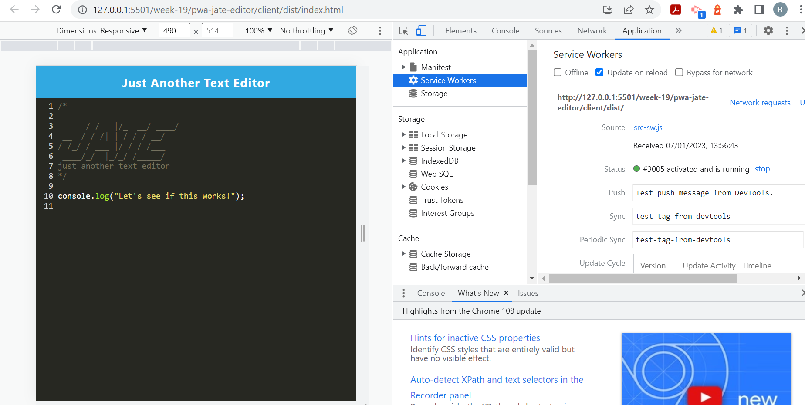

# Week 19: PWA Text Editor

## Description

This repository is where I refactor code for a PWA text editor application. Just Another Text Editor, or J.A.T.E, is used to view and save text and includes next-gen JavaScript syntax highlighting. J.A.T.E has also been configured as a PWA app with a service worker to manage caching for a seemless offline experience.

## Installation

N/A

## Usage

Open the website to start the J.A.T.E text editor application. Here you can add text and it will be saved to the editor. You can use next-gen ES6 JavaScript syntax and the content within the editor will be highlighted accordingly. To save a copy of the text editor to your desktop, click the Install button. An icon will be added to your desktop. When you click out of the text box, a copy of the text content will be saved to the database, as well as to your local storage. When you re-open J.A.T.E, the stored content will populate the editor.

Deployed URL: (#)

## Credits

Starter code provided by Monash University.

The following resources were referenced to ensure best practice and adherence to appropriate conventions:

Workbox Documentation: (https://developer.chrome.com/docs/workbox/managing-fallback-responses/)

Inject Manifest Documentation: (https://developer.chrome.com/docs/workbox/reference/workbox-build/#type-WebpackInjectManifestOptions)

Webpack Documentation: (https://webpack.js.org/configuration/module/#condition)

Workbox-Recipes Documentation: (https://developer.chrome.com/docs/workbox/modules/workbox-recipes/)

Offline-Fallback Documentation: (https://developer.chrome.com/docs/workbox/reference/workbox-recipes/#method-offlineFallback)

Webpack-PWA-Manifest Documentation via npm: (https://www.npmjs.com/package/webpack-pwa-manifest)

Web App Manifests by MDN Web Docs: (https://developer.mozilla.org/en-US/docs/Web/Manifest)

IndexDB documentation via npm: (npmjs.com/package/idb)

Workbox Precaching Documentation: (https://developer.chrome.com/docs/workbox/modules/workbox-precaching/)

Workbox Caching Strategies Overview: (https://developer.chrome.com/docs/workbox/caching-strategies-overview/)

Heroku Deployement Guide by The Full-Stack Blog: (https://coding-boot-camp.github.io/full-stack/heroku/heroku-deployment-guide)

Common js functions and parameters, for loops and arrays: JS CheatSheet by HTML CheatSheet (https://htmlcheatsheet.com/js/)

## License

Licensed under the standard MIT license. Please refer to the license in the repo for more information.
